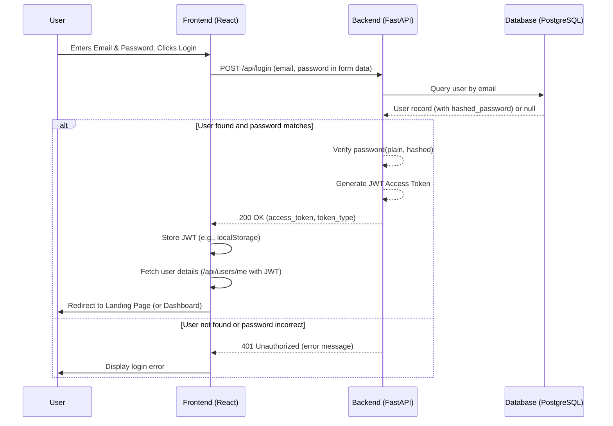
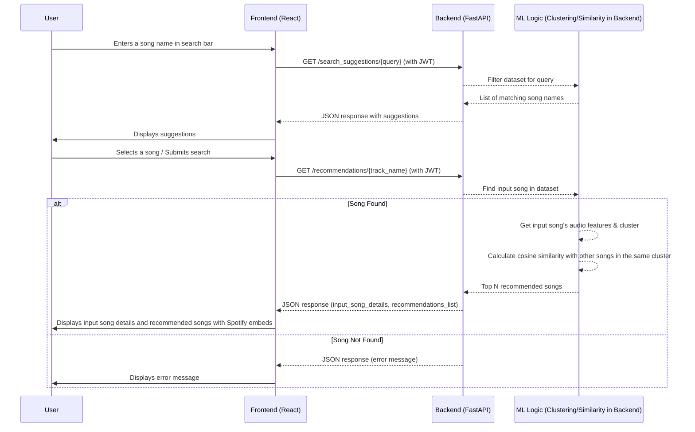

# Spotify Recommendation Engine

## 1. Overview

The Spotify Recommendation Engine is a full-stack web application designed to provide personalized song recommendations. Users can search for a song they like, and the system will suggest similar tracks based on their audio features. The application features user authentication, allowing users to sign up and log in to access the recommendation service. It leverages a dataset of songs, applies machine learning techniques for clustering and similarity matching, and is fully containerized using Docker for ease of deployment and scalability.

## 2. Features

*   **Song Recommendations:** Get personalized song suggestions based on an input song.
*   **Song Search with Suggestions:** Autocomplete-style search suggestions as you type a song name.
*   **Embedded Song Previews:** Listen to a preview of recommended songs directly on the page via an embedded Spotify player.
*   **User Authentication:** Secure sign-up and login functionality for users.
*   **Responsive Design:** User interface adapts to different screen sizes.
*   **Interactive Carousels:** Information sections on the landing page and recommendation cards are displayed in horizontally scrollable carousels.

## 3. Tech Stack

**Frontend:**
*   React (v18+)
*   React Router (v6) for navigation
*   CSS3 (custom styling, flexbox, grid)
*   JavaScript (ES6+)
*   Context API for global state management (Authentication)

**Backend:**
*   Python (v3.9+)
*   FastAPI for building robust and fast APIs
*   SQLAlchemy as ORM for database interaction
*   Pydantic for data validation and settings management
*   Passlib (with bcrypt) for password hashing
*   Python-JOSE for JWT generation and validation
*   Uvicorn as ASGI server

**Database:**
*   PostgreSQL

**Machine Learning:**
*   Pandas for data manipulation
*   Scikit-learn for:
    *   `StandardScaler` for feature scaling
    *   `KMeans` for clustering songs based on audio features
    *   `cosine_similarity` for finding similar songs within clusters

**Containerization & Deployment:**
*   Docker
*   Docker Compose

## 4. Project Structure

```
Music-Recommendation-System/
├── backend/
│   ├── .venv/ (or similar, virtual environment - not committed)
│   ├── __pycache__/ (Python cache - not committed)
│   ├── alembic/ (For database migrations - if initialized)
│   ├── alembic.ini (Alembic config - if initialized)
│   ├── auth.py             # Authentication logic, JWT, password hashing
│   ├── database.py         # SQLAlchemy setup, database session
│   ├── main.py             # FastAPI app, API endpoints, ML logic
│   ├── models.py           # SQLAlchemy User model
│   ├── schemas.py          # Pydantic models for request/response validation
│   ├── Dockerfile          # Docker configuration for the backend
│   ├── requirements.txt    # Python dependencies
│   └── top_10000_1950-now.csv # Dataset for song recommendations
├── frontend/
│   ├── node_modules/ (Installed dependencies - not committed)
│   ├── public/
│   │   └── index.html      # Main HTML template
│   │   └── ... (other static assets)
│   ├── src/
│   │   ├── components/     # React components
│   │   │   ├── AuthForm.css
│   │   │   ├── LandingPage.css
│   │   │   ├── LandingPage.js
│   │   │   ├── LoginPage.js
│   │   │   ├── RecommendationPage.js
│   │   │   └── SignupPage.js
│   │   ├── context/
│   │   │   └── AuthContext.js # Global authentication state
│   │   ├── App.css           # Global app styles
│   │   ├── App.js            # Main application component with routing
│   │   ├── index.css         # Base styles
│   │   ├── index.js          # Entry point of the React application
│   │   └── ... (other utility files, images)
│   ├── .env (Optional, for environment variables - not committed)
│   ├── Dockerfile          # Docker configuration for the frontend (Nginx)
│   ├── package-lock.json
│   └── package.json        # Frontend dependencies and scripts
├── .git/                   # Git repository data
├── .gitignore              # Specifies intentionally untracked files
├── docker-compose.yml      # Defines and configures multi-container Docker application
└── README.md               # This file
```

## 5. Setup and Running the Project

### Prerequisites

*   **Docker Desktop:** Ensure Docker Desktop is installed and running on your system. It includes Docker Engine and Docker Compose.

### Steps to Run

1.  **Clone the Repository (Optional):**
    If you haven't already, clone the project repository to your local machine:
    ```bash
    git clone <repository_url>
    cd Music-Recommendation-System
    ```

2.  **Important Environment Variable - Backend `SECRET_KEY`:**
    Before building for the first time, or if you want to ensure security, **you MUST change the placeholder `SECRET_KEY`** in `backend/auth.py`.
    *   Open `backend/auth.py`.
    *   Locate the line: `SECRET_KEY = "YOUR_VERY_SECRET_KEY" # CHANGE THIS!`
    *   Replace `"YOUR_VERY_SECRET_KEY"` with a strong, unique secret key. You can generate one using OpenSSL or a password manager. For example, using OpenSSL in your terminal:
        ```bash
        openssl rand -hex 32
        ```
        Copy the generated string and paste it as your `SECRET_KEY`.

3.  **Build and Run with Docker Compose:**
    Navigate to the root directory of the project (where `docker-compose.yml` is located) and run the following command in your terminal:
    ```bash
    docker-compose up --build
    ```
    *   `--build`: Forces Docker Compose to rebuild the images if there are any changes to the Dockerfiles or application code.
    *   You can add `-d` to run in detached mode (in the background): `docker-compose up --build -d`

4.  **Accessing the Application:**
    *   **Frontend:** Open your web browser and navigate to `http://localhost:3000`
    *   **Backend API (for testing/docs):** The API will be running at `http://localhost:8000`. You can access the auto-generated FastAPI documentation at `http://localhost:8000/docs`.

5.  **Stopping the Application:**
    *   If running in the foreground (without `-d`), press `Ctrl+C` in the terminal.
    *   If running in detached mode, use: `docker-compose down`

### Database Port Note
The PostgreSQL database container's port `5432` is mapped to port `5433` on the host machine (`5433:5432` in `docker-compose.yml`) to avoid potential conflicts with local PostgreSQL installations. If you need to connect to the database directly from your host machine (e.g., using pgAdmin), use `localhost` as the host and `5433` as the port. The backend service connects to the database internally using Docker's network at `db:5432`.

## 6. System Architecture & Flowcharts

### a. High-Level System Architecture

This diagram shows the main components and their interactions.

```mermaid
graph TD
    User[ User] -- Interacts via Browser --> FE[ Frontend (React on Nginx)];
    FE -- API Requests (HTTP/S) --> BE[ Backend (FastAPI)];
    BE -- CRUD Operations (Auth) --> DB[ PostgreSQL Database];
    BE -- Reads Song Data --> CSV[ Song Data CSV];
    BE -- Uses ML Model --> ML[ ML Model (Clustering/Similarity)];

    subgraph Docker Environment
        FE
        BE
        DB
        CSV
        ML
    end

    style User fill:#fff,stroke:#333,stroke-width:2px
    style FE fill:#e6f7ff,stroke:#007bff,stroke-width:2px
    style BE fill:#e6ffe6,stroke:#28a745,stroke-width:2px
    style DB fill:#fff0e6,stroke:#fd7e14,stroke-width:2px
    style CSV fill:#f0f0f0,stroke:#6c757d,stroke-width:2px
    style ML fill:#f0f0f0,stroke:#6c757d,stroke-width:2px
```

**Explanation:**
*   The **User** interacts with the **Frontend** (React application served by Nginx).
*   The **Frontend** makes API calls to the **Backend** (FastAPI application).
*   For user authentication (signup/login), the **Backend** interacts with the **PostgreSQL Database**.
*   For song recommendations, the **Backend** loads data from the **Song Data CSV** and applies a pre-trained **Machine Learning Model** (KMeans clustering and cosine similarity).
*   All services (Frontend, Backend, Database) are containerized and orchestrated by Docker Compose.

### b. User Authentication Flow (Login Example)



### c. Song Recommendation Flow



## 7. Components Deep Dive

### a. Backend (`backend/`)

*   **`main.py`**:
    *   Initializes the FastAPI application.
    *   Sets up CORS middleware.
    *   Loads and preprocesses the song data (`top_10000_1950-now.csv`) on startup:
        *   Handles missing values.
        *   Scales audio features using `StandardScaler`.
        *   Applies `KMeans` clustering to group songs.
    *   Defines API endpoints:
        *   Authentication: `/api/signup`, `/api/login`, `/api/users/me`.
        *   Recommendations: `/recommendations/{track_name}` (protected).
        *   Search: `/search_suggestions/{query}` (protected).
    *   Integrates with `auth.py` for security and `database.py` for user data.
*   **`database.py`**:
    *   Configures the SQLAlchemy database engine using `DATABASE_URL` from environment variables.
    *   Creates `SessionLocal` for database sessions.
    *   Defines `Base` for declarative models.
    *   Provides `get_db` dependency for FastAPI to inject database sessions into path operation functions.
*   **`models.py`**:
    *   Defines the `User` SQLAlchemy model with fields: `id`, `email`, `hashed_password`, `created_at`.
*   **`schemas.py`**:
    *   Contains Pydantic models for data validation and serialization:
        *   `UserCreate`: For user sign-up request.
        *   `UserOut`: For representing user data in responses (excludes password).
        *   `UserLogin`: For user login request.
        *   `Token`: For JWT access token response.
        *   `TokenData`: For data encoded within the JWT.
*   **`auth.py`**:
    *   Manages all authentication-related logic.
    *   `SECRET_KEY`, `ALGORITHM`, `ACCESS_TOKEN_EXPIRE_MINUTES` for JWT configuration.
    *   `pwd_context` (Passlib) for hashing and verifying passwords using bcrypt.
    *   `oauth2_scheme` (FastAPI's `OAuth2PasswordBearer`) for token handling.
    *   Functions: `verify_password`, `get_password_hash`, `create_access_token`.
    *   Dependencies: `get_current_user`, `get_current_active_user` to protect endpoints and provide user information.
*   **`Dockerfile` (`backend/Dockerfile`)**:
    *   Uses `python:3.9-slim` as the base image.
    *   Sets the working directory to `/app`.
    *   Copies `requirements.txt` and installs dependencies.
    *   Copies the rest of the backend application code.
    *   Specifies the command to run Uvicorn (`CMD ["uvicorn", "main:app", "--host", "0.0.0.0", "--port", "8000"]`).
*   **`requirements.txt`**: Lists all Python dependencies for the backend.
*   **`top_10000_1950-now.csv`**: The dataset containing song information and audio features used by the recommendation model.

### b. Frontend (`frontend/`)

*   **`App.js` (`src/App.js`)**:
    *   The main component that sets up routing using `react-router-dom`.
    *   Manages the overall layout, including a conditional navigation bar.
    *   Integrates `AuthContext` to access user state and authentication functions (logout).
    *   Defines public routes (`/`, `/login`, `/signup`) and protected routes (`/recommendations`) using a `ProtectedRoute` component.
*   **`index.js` (`src/index.js`)**:
    *   The entry point for the React application.
    *   Renders the `App` component into the DOM.
    *   Wraps the `App` component with `BrowserRouter` (for routing) and `AuthProvider` (to provide authentication context to all components).
*   **`LandingPage.js` (`src/components/LandingPage.js`)**:
    *   The home page of the application.
    *   Displays project overview, how it works, and system architecture in interactive, horizontally scrollable carousels.
    *   Includes a "Get Started" button that navigates to the `/recommendations` page (which will redirect to login if not authenticated).
    *   Implements click-to-center functionality for info cards in the carousel.
*   **`RecommendationPage.js` (`src/components/RecommendationPage.js`)**:
    *   The core page for song search and recommendations.
    *   Contains a search input for users to enter a song name.
    *   Fetches and displays search suggestions as the user types.
    *   On submission, fetches and displays the input song details and a list of recommended songs.
    *   Each recommended song card includes an embedded Spotify player for song previews.
    *   Uses `AuthContext` to retrieve the JWT token for making authenticated API calls to the backend.
*   **`LoginPage.js` & `SignupPage.js` (`src/components/`)**:
    *   Provide forms for user login and registration respectively.
    *   Handle form input, validation (basic), and submission.
    *   Use `AuthContext` functions (`login`, `signup`) to interact with the backend API.
    *   Manage error display and navigation upon success or failure.
*   **`AuthContext.js` (`src/context/AuthContext.js`)**:
    *   Creates a React Context (`AuthContext`) for global authentication state management.
    *   `AuthProvider` component:
        *   Manages `user`, `token`, and `isLoading` state.
        *   Handles token storage in `localStorage`.
        *   Provides `login`, `logout`, and `signup` functions that make API calls to the backend.
        *   Includes `fetchUserDetails` to get current user information based on the stored token.
*   **CSS Files (`App.css`, `LandingPage.css`, `AuthForm.css`, etc.)**:
    *   Contain custom styles for various components and the overall application layout, ensuring a responsive and consistent user interface.
*   **`Dockerfile` (`frontend/Dockerfile`)**:
    *   Uses a multi-stage Docker build for an optimized production image.
    *   **Build Stage (`node:18-alpine as build`):**
        *   Sets up a Node.js environment.
        *   Copies `package.json` and `package-lock.json`, installs dependencies (`npm ci` or `npm install`).
        *   Copies the rest of the frontend application code.
        *   Runs `npm run build` to create a static production build of the React app (typically in the `/app/build` directory).
    *   **Serve Stage (`nginx:stable-alpine`):**
        *   Uses `nginx:stable-alpine` as the base image for serving static files.
        *   Copies the production build output from the `build` stage to Nginx's webroot (`/usr/share/nginx/html`).
        *   Nginx is configured by default to serve `index.html` and handle client-side routing appropriately.
*   **`package.json`**: Lists frontend dependencies (React, React Router, etc.) and defines scripts (like `start`, `build`).

### c. `docker-compose.yml`

*   Defines the multi-container application setup:
    *   **`backend` service:**
        *   Builds from `backend/Dockerfile`.
        *   Maps port `8000` (container) to `8000` (host).
        *   Mounts `./backend:/app` as a volume for live code reloading during development.
        *   Depends on the `db` service.
        *   Sets the `DATABASE_URL` environment variable for the backend to connect to the PostgreSQL database.
    *   **`frontend` service:**
        *   Builds from `frontend/Dockerfile`.
        *   Maps port `80` (container - Nginx default) to `3000` (host).
        *   Mounts `./frontend/src:/app/src` as a volume (useful if the Dockerfile supports dev mode, otherwise primarily for build context).
        *   Depends on the `backend` service (ensures backend starts before frontend, though not strictly necessary for API calls as frontend handles API availability).
    *   **`db` service:**
        *   Uses the official `postgres:13` image.
        *   Mounts a named volume `postgres_data` to `/var/lib/postgresql/data` for persistent database storage.
        *   Maps port `5432` (container) to `5433` (host) to avoid conflicts.
        *   Sets environment variables (`POSTGRES_USER`, `POSTGRES_PASSWORD`, `POSTGRES_DB`) to initialize the database.
*   Defines the named volume `postgres_data`.

## 8. API Endpoints (Backend)

All user-facing API endpoints are prefixed with `/api`.

*   **Authentication:**
    *   `POST /api/signup`: Creates a new user.
        *   Request Body: `{ "email": "user@example.com", "password": "yourpassword" }`
        *   Response: User details (excluding password).
    *   `POST /api/login`: Logs in an existing user.
        *   Request Body: Form data (`username` (for email), `password`).
        *   Response: `{ "access_token": "your_jwt_token", "token_type": "bearer" }`
    *   `GET /api/users/me`: Retrieves details of the currently authenticated user.
        *   Requires JWT in `Authorization: Bearer <token>` header.
        *   Response: User details (excluding password).

*   **Recommendations & Search (Protected - Require Authentication):**
    *   `GET /recommendations/{track_name}`: Gets song recommendations for a given track name.
        *   Example: `/recommendations/Bohemian%20Rhapsody`
        *   Query Parameter: `top_n` (optional, default 5) for number of recommendations.
        *   Response: `{ "input_song": {details}, "recommendations": [{details}, ...] }`
    *   `GET /search_suggestions/{query}`: Gets song name suggestions based on a search query.
        *   Example: `/search_suggestions/love`
        *   Query Parameter: `limit` (optional, default 10) for number of suggestions.
        *   Response: `[{ "Track Name": "...", "Artist Name(s)": "..." }, ...]`

*   **Root:**
    *   `GET /`: Simple health check or welcome message for the API.

## 9. Future Improvements / Considerations

*   **Database Migrations:** Implement robust database schema migrations using Alembic (already in `requirements.txt` but not fully set up with versioning scripts).
*   **Advanced Error Handling:** More user-friendly and specific error messages on both frontend and backend. Global error interceptors.
*   **Testing:** Implement unit tests (e.g., PyTest for backend, Jest/React Testing Library for frontend) and integration tests.
*   **CI/CD Pipeline:** Set up a Continuous Integration/Continuous Deployment pipeline (e.g., using GitHub Actions) for automated testing and deployment.
*   **Refined Recommendation Model:**
    *   Explore collaborative filtering or hybrid models.
    *   Allow users to rate songs and incorporate feedback.
    *   Regularly update the song dataset.
*   **User Profiles:** Allow users to save favorite songs, view recommendation history, or set preferences.
*   **Enhanced UI/UX:** Further improvements to user interface design, animations, and overall user experience.
*   **Configuration Management:** Move sensitive configurations (like `SECRET_KEY`, detailed database credentials) completely out of code and into environment variables or a dedicated configuration management system for production.
*   **Scalability:** For higher loads, consider options like load balancing for the backend, a more scalable database solution, and optimizing API performance.
*   **Logging & Monitoring:** Implement more comprehensive logging and set up monitoring dashboards (e.g., using ELK stack, Prometheus/Grafana).

---

This README should provide a good starting point for understanding and presenting your project. Remember to replace `<repository_url>` if you include the cloning step. 